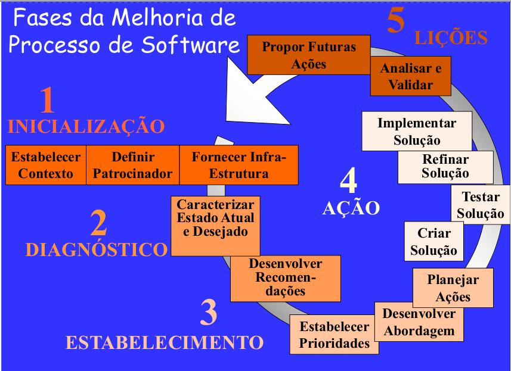

# Modelo de Melhoria de Processo de Software

## Introdução

Um processo de software é o conjunto de atividades e procedimentos que são executados com o objetivo de construir um produto de software. Para que o produto a ser obtido tenha uma qualidade alta, é importante que o seu processo de fabricação, ou seja, o processo utilizado para produzir o produto de software seja efetivo e melhorado continuamente. O ato de melhorar um processo de software é denominado Melhoria de Processo de Software, ou SPI.

Um modelo de melhoria de processo de software é um modelo que define atividades, práticas, artefatos e uma metodologia no geral para realizar a melhoria de um processo de software já existente. Estes modelos são úteis porque são padronizados, testados em diferentes situações e funcionam como um guia para realizar a melhoria de um processo.

Existem vários modelos que podem ser utilizados para realizar a melhoria de processo de software, cada um com suas vantagens e desvantagens, podendo ser aplicados em diferentes contextos. No contexto da empresa **Go Horse +**, o modelo a ser utilizado é o **Modelo IDEAL**.

Durante um programa de melhoria de processo de software é importante seguir um modelo para ter um rumo e conseguir ter melhores resultados durante a execução deste programa. No contexto da matéria de Melhoria de Processo de Software foi designado ao grupo utilizar o modelo IDEAL \(Initiating-Diagnosing-Establishing-Acting-Learning\).

## O Modelo IDEAL

O modelo IDEAL, é um modelo para Melhoria de Processo de Software, desenvolvido pelo Software Engineering Institute. Ele descreve um modelo de programa de melhoria de processos de software \(SPI\), que pode ser usado para orientar o desenvolvimento de um plano integrado de longo alcance para iniciar e gerenciar um programa SPI.

O modelo IDEAL, descreve cinco fases \(Fígura 1\) de uma iniciativa de SPI que fornecem um loop contínuo através das etapas necessários para o SPI.

## Fases do Modelo IDEAL

### 1. Iniciação

A fase de iniciação do modelo IDEAL é o ponto de partida. Aqui é onde a infra-estrutura de melhoria inicial é estabelecida, e suas funções e responsabilidades são definidas e os recursos iniciais são atribuídos. Nessa fase, um plano SPI é criado para orientar a organização durante as fases de inicialização, diagnóstico e estabelecimento.

Os objetivos gerais do programa SPI são definidos durante a fase de iniciação. Eles são estabelecidos a partir das necessidades de negócios da organização e serão aperfeiçoados e tornados específicos durante a fase de estabelecimento do IDEAL.

### 2. Diagnóstico

A fase de Diagnóstico do modelo IDEAL inicia a organização no caminho da melhoria contínua do processo de software. Nessa fase, o plano de ação da SPI é iniciado de acordo com a visão da organização, plano estratégico de negócios, lições aprendidas de trabalhos de melhoria no passado, principais problemas de negócios enfrentados pela organização e metas de longo prazo.

### 3. Estabelecimento

Durante a fase de estabelecimento, ocorre a priorização das atividades de melhoria e se criam estratégias para buscar as soluções. O esboço do plano de ação da SPI será concluído de acordo com a visão da organização, plano estratégico de negócios, lições aprendidas de trabalhos de melhoria no passado, principais problemas de negócios enfrentados pela organização e metas de longo prazo.

Durante a fase de estabelecimento, metas mensuráveis ​​são desenvolvidas a partir dos objetivos gerais definidos na fase de iniciação. Essas metas mensuráveis ​​serão incluídas na versão final do plano de ação da SPI.

Por fim, são definidas métricas para se monitorar o processo.

### 4. Ação

Na fase de Ação do modelo IDEAL, as soluções para abordar as áreas de melhoria descobertas durante a fase de Diagnóstico são criadas, testadas e implantadas em toda a organização. Serão desenvolvidos planos para executar pilotos para testar e avaliar os processos novos ou aprimorados.

### 5. Lições

O objetivo desta fase é tornar a próxima passagem pelo modelo IDEAL mais eficaz. As soluções foram desenvolvidas, as lições foram aprendidas e as métricas de desempenho e realização de metas foram coletadas. Esses artefatos se tornarão uma fonte de informações para o pessoal envolvido na próxima passagem pelo modelo.

Usando essas informações coletadas, uma avaliação da estratégia, métodos e infraestrutura usada no programa SPI pode ser realizada. Ao fazer isso, correções ou ajustes na estratégia, métodos ou infraestrutura podem ser feitos antes do início.

