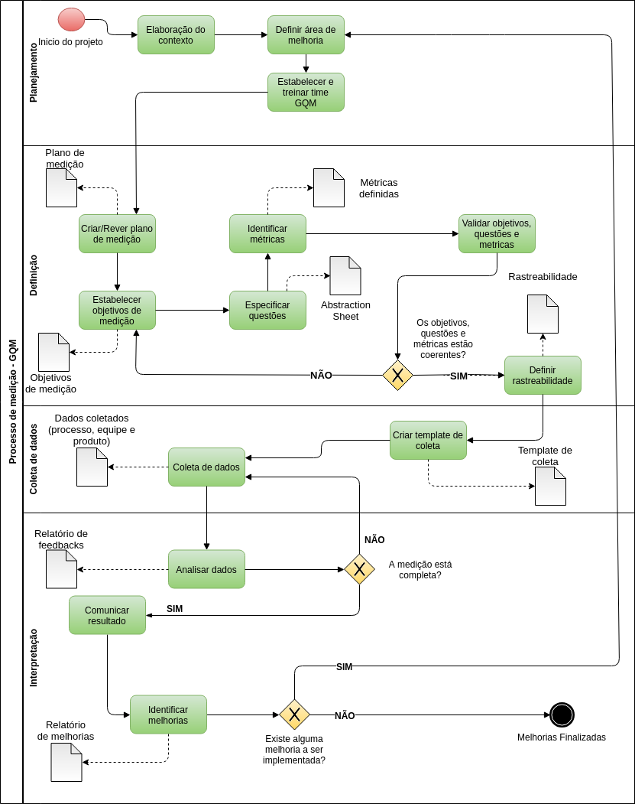

# Processo de Medição e Análise

## 

### 

### 1.1. Atividades do Subprocesso de Medição e Análise

No contexto atual a equipe de processo e equipe de desenvolvimento atual como equipe de medição.

#### 1.1.1. Elaboração do Contexto

* **Descrição** Identificar e elaborar o contexto na qual o GQM será aplicado.
* **Responsável** Equipe de medição.
* **Participantes** Equipe de medição.
* **Produto Gerado** Plano de medição.
* **Próxima Atividade** Definir áreas de melhoria.
* **Tarefas:**
  * Identificar o contexto na qual o GQM será aplicado.
  * Documentar no plano de medição.

#### 1.1.2. Definição da Área de Melhoria

* **Descrição** Selecionar melhorias de produto ou processo ou equipe desejada.
* **Responsável** Equipe de medição.
* **Participantes** Equipe de medição.
* **Produto Gerado** Plano de medição refinado.
* **Próxima Atividade** Coletar métricas do processo.
* **Tarefa:**
  * Selecionar a melhoria que irá realizar \(produto, processo, equipe\) ou uma combinação deles.

#### 1.1.3. Estabelecer e Treinar Time GQM

* **Descrição** De acordo com a melhoria selecionada estabelecer e treinar a equipe que irá executar o GQM.
* **Responsável** Equipe de medição.
* **Participantes** Equipe de medição.
* **Produto Gerado** Plano de medição refinado.
* **Tarefas:**
  * Selecionar equipe de processo
  * Treinar equipe de acordo com o processo.

#### 1.1.4. Criar ou Rever Plano de Medição

* **Descrição** ​Nessa etapa é criado ou refinado o plano de medição.
* **Responsável** Equipe de medição.
* **Participantes** Equipe de medição.
* **Produto Gerado** Plano de medição.
* **Tarefas:**
  * Criar uma leve introdução do plano.
  * Descrição organizacional.
  * Definir papéis e responsabilidades no processo de Medição.
  * Especificações de medições do projeto de software \(GQM\).
  * Planejamento das Coletas.

#### 1.1.5. Estabelecer Objetivos de Medição

* **Descrição** Elaborar definições claras e estruturadas para os objetivos de medição.
* **Responsável** Equipe de medição.
* **Participantes** Equipe de medição.
* **Produto Gerado** Objetivos de medição.
* **Tarefa:** 
  * Documentar os objetivos de medição no documento GQM.

#### 1.1.6. Especificar Questões

* **Descrição** Identificar as questões relacionadas aos objetivos propostos.
* **Responsável** Equipe de medição.
* **Participantes** Equipe de medição.
* **Produto Gerado** Abstraction Sheets.
* **Tarefas**:
  * **Foco de qualidade** - São as questões focadas na qualidade
  * **Fatores de variança** - É o que pode variar no decorrer da coleta das métricas para responder às questões
  * **Hipotése de Baseline** - Como a equipe no momento responderia essas questões
  * **Impactos nas hipotéses de baseline** - São os impactos que as fontes de variação causam nas hipóteses de baseline.

#### 1.1.7. Identificar Métricas

* **Descrição** Associar um conjunto de dados a cada questão de forma a respondê-la quantitativamente.
* **Responsável** Equipe de medição.
* **Participantes** Equipe de medição.
* **Produto Gerado** Métricas definidas.
* **Tarefa:** 
  * Documentar as métricas no documento GQM.

#### 1.1.8. Validar Objetivos, Questões e Métricas

* **Descrição** Verificar a consistência e completude das métricas em relação ao objeto que desejamos medir.
* **Responsável** Equipe de medição.
* **Participantes** Equipe de processo e Equipe de qualidade.
* **Produto Gerado** N/A.
* **Tarefa:** 
  * Verificar a consistência e completude das métricas, questões e objetivos.

#### 1.1.9. Definir Rastreabilidade 

* **Descrição** Após as métricas, questões e objetivos estiverem validados, definir a rastreabilidade das mesmas.
* **Responsável** Equipe de medição.
* **Participantes** Equipe de medição.
* **Produto Gerado** Diagrama de rastreabilidade.
* **Tarefas:** 
  * Inserir o diagrama no documento GQM

#### 1.1.10. Criar template de coleta

* **Descrição** Criar um template para começar a coleta de métricas.
* **Responsável** Equipe de medição.
* **Participantes** Equipe de medição.
* **Produto Gerado** Template de coleta.
* **Tarefas:** 
  * Criar um template de coleta de dados

#### 1.1.11. Coleta de dados

* **Descrição** Executar o plano de medição, realizando as medições definidas e armazenando os resultados.
* **Responsável** Equipe de medição.
* **Participantes** Equipe de medição.
* **Produto Gerado** Métricas de processo, produto e equipe coletados.
* **Tarefas:** 
  * Documentar os dados coletados, utilizando um template de coleta para padronização.

#### 1.1.12 Análise de dados

* **Descrição** Envolvidos analisam e interpretam as medições.
* **Responsável** Equipe de medição.
* **Participantes** Equipe de medição.
* **Produto Gerado** Relatório de Feedbacks.
* **Tarefas:** 
  * Analisar e interpretar os dados e gerar o relatório de feedback.

#### 1.1.13 Comunicar resultados

* **Descrição** Comunicar aos envolvidos os resultados da métricas coletadas no relatório para que se possa identificar melhorias e implementa-las.
* **Responsável** Equipe de medição.
* **Participantes** Todas as equipes.
* **Produto Gerado** N/A.
* **Tarefas:** 
  * Mostrar relatório de feedbacks aos envolvidos

#### 1.1.14 Identificar melhorias

* **Descrição** O relatório deve conter todas as medições coletadas, interpretações, conclusões e Ações a serem tomadas a partir dos resultados.
* **Responsável** Equipe de medição.
* **Participantes** Equipe de medição.
* **Produto Gerado** Relatório de melhorias.
* **Tarefas** :
  * Gerar o relatório de melhorias

#### 

