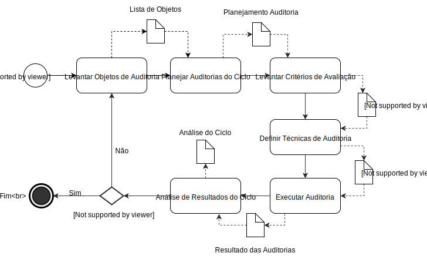

# Processo de Gestão de Qualidade

Este processo descreve as atividades de auditoria de todas as áreas da organização, como equipe, produto, artefatos e o próprio processo. Ele tem como objetivo de assegurar que o projeto está sendo desenvolvido de acordo com suas especificações e satisfazendo as necessidades do cliente.

## 

### Levantar Objetos de Auditoria

* **Descrição:** Devem ser levantados todos os documentos que serão analisados durantes as auditorias.
* **Responsável:** Time de gestão de qualidade.
* **Participantes:** Time de gestão de qualidade.
* **Produto Gerado:** Lista de Objetos.
* **Próxima Atividade:** Planejar Auditorias do Ciclo.
* **Tarefas:** 
    * Definição dos objetivos da auditoria.
    * Levantar documentos.
    * Decidir quais documentos possuem informações relevantar para os objetivos levantados.

### Planejar Auditorias do Ciclo

* **Descrição:** Analisando os documentos e objetivos de todas as auditorias, serão priorizados quais destes serão executados durante este ciclo.

* **Responsável:** Time de gestão de qualidade.
* **Participantes:** Time de gestão de qualidade.
* **Produto Gerado:** Planejamento de Auditoria.
* **Próxima Atividade:** Levantar Critérios de Avaliação.
* **Tarefas:** 
    * Priorizar objetivos das auditorias.
    * Definir objetivos que serão abordados neste ciclo.
    * Definir documentos que serão analisados neste ciclo.

### Levantar Critérios de Avaliação

* **Descrição:** Devem ser definidas metas objetivas, para cada uma das etapas, onde a auditoria só será considerada realizada caso estas sejam cumpridas.

* **Responsável:** Time de gestão de qualidade.
* **Participantes:** Time de gestão de qualidade.
* **Produto Gerado:** Planejamento de Auditoria Atualizado.
* **Próxima Atividade:** Definir técnicas de auditoria.
* **Tarefas:** 
    * Definir critérios.

